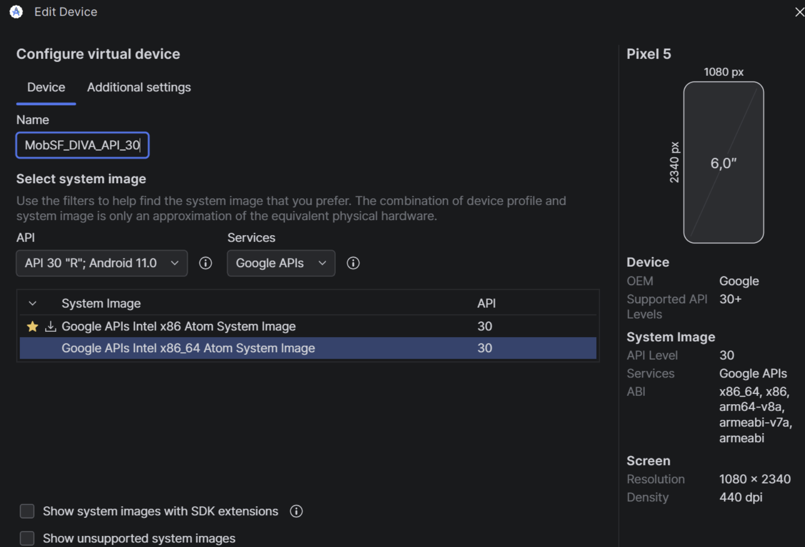
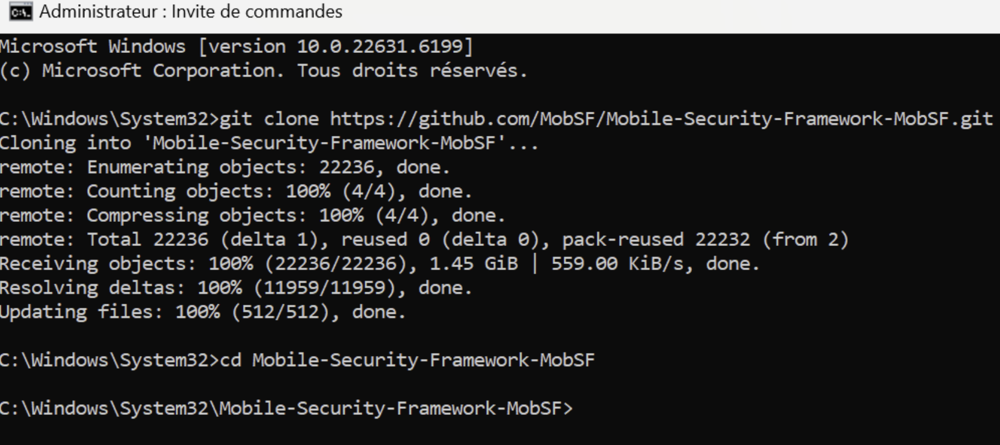
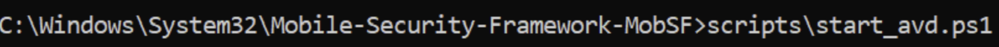
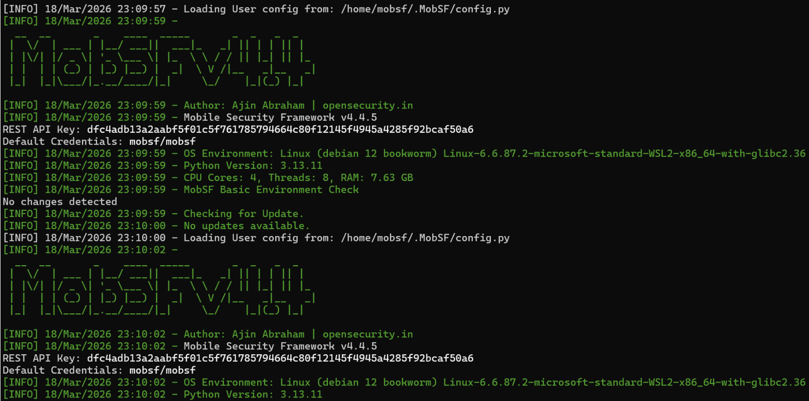
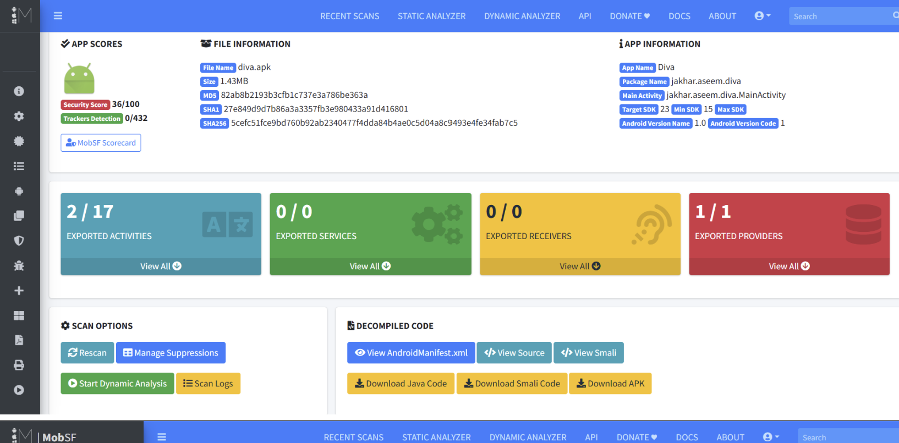
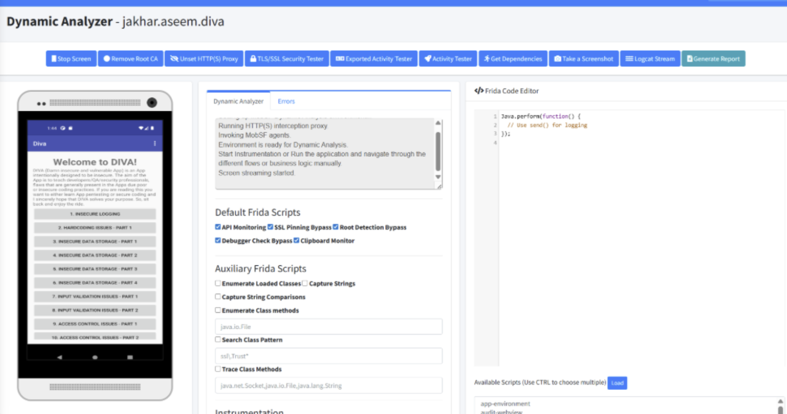
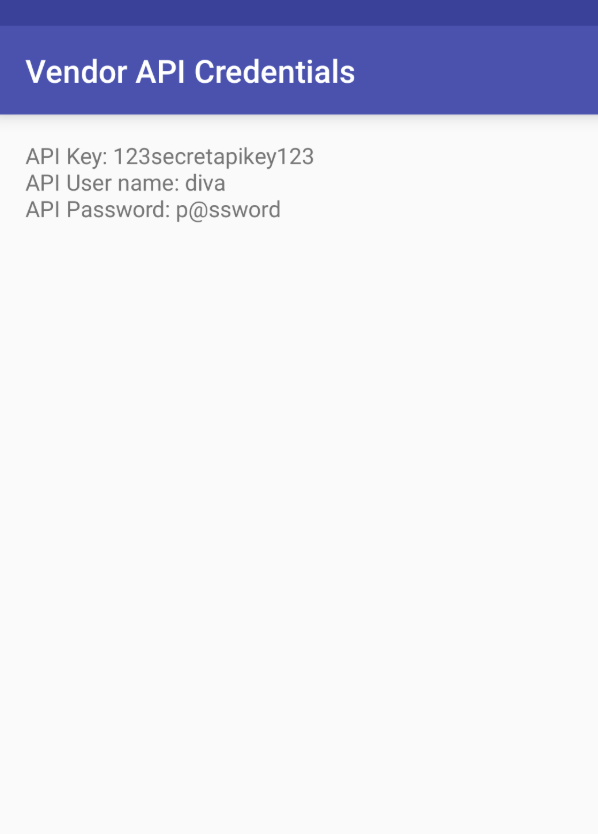

# LAB 7 : Analyse Dynamique Mobile avec MobSF  

**Auteur :** Oumayma Benhilal  
**Cours :** Sécurité des applications mobiles  

## Objectifs du lab  
- Comprendre en profondeur l’analyse dynamique (runtime) d’une application Android avec **MobSF**.  
- Configurer un émulateur propre sans Play Store.  
- Installer/lancer MobSF via Docker.  
- Tester l’APK vulnérable **DIVA** (Damn Insecure and Vulnerable Android App) en dynamique : logs runtime, trafic réseau, instrumentation Frida, proxy HTTPS, etc.  
- Détecter des vulnérabilités en temps réel (stockage insecure, intents, hard-coded secrets, etc.).  

## Prérequis
- Android Studio avec AVD Manager
- Git
- Docker (ou environnement Linux/WSL pour l'exécution directe)
- L'APK de l'application DIVA

## Étapes réalisées  

### 1. Création AVD sans Play Store  
Pour cette analyse, nous avons configuré un émulateur Android (Pixel 5, API 30) spécifiquement sans Google Play Store afin de garantir un environnement contrôlé pour MobSF.

### 2. Clonage MobSF  
Récupération du dépôt officiel de Mobile Security Framework (MobSF) depuis GitHub.

### 3. Lancement émulateur avec script MobSF (rooté)  
Utilisation du script `start_avd.ps1` fourni par MobSF pour démarrer l'émulateur avec les privilèges root nécessaires pour l'analyse dynamique.

### 4. Installation et lancement de MobSF  
Démarrage du service MobSF. Une fois lancé, l'interface web est accessible localement.

### 5. Téléchargement APK DIVA  
*(L'APK a été préalablement téléchargé pour être analysé par MobSF)*

### 6. Analyse statique et dynamique de DIVA  
**Analyse Statique :** MobSF génère un rapport détaillant les composants de l'application (activités exportées, permissions, etc.) et lui attribue un score de sécurité.

**Analyse Dynamique :** L'interface de l'analyseur dynamique permet d'interagir en temps réel avec l'application sur l'émulateur. On y retrouve divers outils comme l'éditeur de code Frida pour l'instrumentation, la capture de trafic HTTPS et les logs système (Logcat).

### 7. Tests avancés personnels (Détection de vulnérabilités)
En naviguant dans l'application, l'analyse a permis d'identifier plusieurs failles critiques, telles que des identifiants API (Vendor API Credentials) codés en dur dans l'application.

## Résultats observés 
L'analyse dynamique a mis en évidence plusieurs vulnérabilités :
- **Hardcoded secrets :** Des clés API et mots de passe stockés en clair (ex: `123secretapikey123`).
- **Stockage Insecure :** Mauvaise gestion des données sensibles.
- **Intents vulnérables :** Possibilité d'invoquer des activités sensibles sans contrôle d'accès approprié.

## Conclusion personnelle et difficultés
Ce laboratoire a permis de mettre en pratique les concepts théoriques de sécurité mobile. La principale difficulté réside souvent dans la configuration initiale de l'environnement (mise en place de l'émulateur rooté, interception HTTPS). Cependant, des outils comme MobSF et Frida s'avèrent extrêmement puissants pour automatiser et approfondir ces analyses de sécurité.

## Dépannage
- Si MobSF ne parvient pas à se connecter à l'émulateur, vérifiez que ce dernier a bien été lancé via le script `mobsf_avd` et non pas directement depuis Android Studio.
- En cas de problème de certificat HTTPS, assurez-vous de l'avoir correctement installé dans le magasin de certificats de l'émulateur via l'interface de MobSF.

## Lien GitHub
[Dépôt du Lab](https://github.com/Oumaymaa659/LAB-7-Analyse-Dynamique-Mobile-avec-MobSF)
